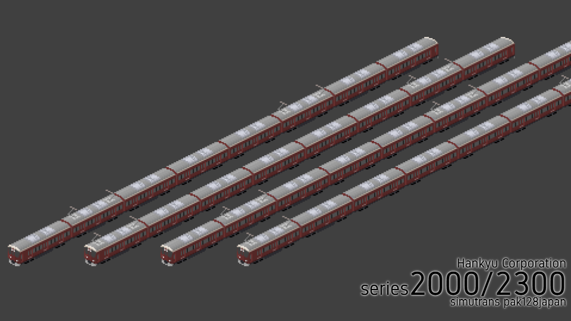

# 阪急電鉄セット
作者 - あるみどり (Twitter:[@G_alumi](https://twitter.com/G_alumi))

ライセンス - [CC BY-NC-SA](https://creativecommons.org/licenses/by-nc-sa/4.0/deed.ja)

ぼちぼち追加していきます。

実装済み
- 新2000/2300系

## 新2000/2300系

屋根上機器に[htrkdk様の京王7000系](https://sites.google.com/site/htrsimu)を使用させていただきました。
この場を借りてお礼申し上げます。

プレスの情報をもとに重量等不明な点は1000系をベースに作成しています。

基本的には
- Tc2000-M2500-M'2600-T2050-T2050-M2500-M'2600-Tc2100 (2000系)
- Tc2300-M2800-M'9600-T2350-T2350-M2800-M'2900-Tc2400 (2300系オール2等)
- Tc2300-M2800-M'9600-T2350-**T2450**-M2800-M'2900-Tc2400 (2300系 **座席指定車が1等**)

のように組んでいただければいいと思います。MM'が共通だったりサハが無限を足せるようにしているため、短い組成やふざけた組成も組めはします。

なお、阪急車にはMcが必要だと思うのでMcとMc'が実装されています。かっこいいね。