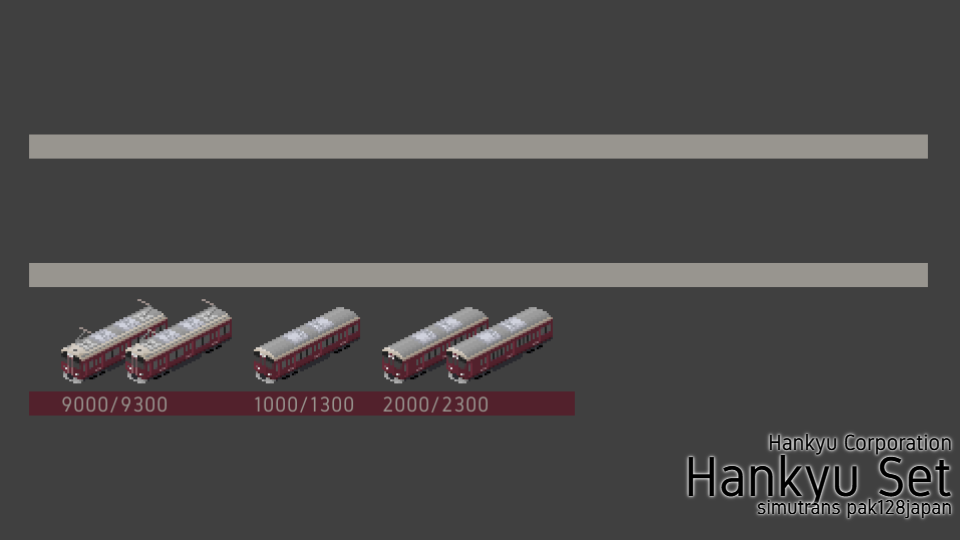

# 阪急電鉄セット

作者 - あるみどり (Twitter:[@G_alumi](https://twitter.com/G_alumi)) & ちょーらぴっど (Twitter:[@S_C_008](https://twitter.com/S_C_008)) 

ライセンス - [CC BY-NC-SA](https://creativecommons.org/licenses/by-nc-sa/4.0/deed.ja)

各種アドオンの屋根上機器に[htrkdk様](https://sites.google.com/site/htrsimu)の京王7000系を使用させていただきました。
この場を借りてお礼申し上げます。

## 更新履歴
### v5.0.0
- 2000系～5300系を追加
- (ソースのディレクトリ構造を変更)
### v4.2.0
- 能勢電鉄7200系を追加
- ja.tabを追加
### v4.1.0
- 6000系ワンマン車を追加
### v4.0.0
- 6000系・7000系列を追加
- 9300系のグラフィックを修正
- 9000系列の後ろ向きMc車の車番を修正
- (ソースのディレクトリ構造を変更)
> [!IMPORTANT]
> v3.x以前からv4.x以降にバージョンアップする際はv4.0.0付属のcompat.tabを適用してください。 
### v3.0.1
- 8000系列のパンタグラフ配置を修正
### v3.0.0
- 8000系列を追加

ぼちぼち追加していきます。

## 実装車両一覧目次
- [新2000系/2300系](#新2000系2300系)
- [新1000系(1300系)](#新1000系1300系)
- [9000系/9300系](#9000系9300系)
- [8000系(8300系)](#8000系8300系)
- [7200系(能勢電鉄)](#7200系能勢電鉄)
- [7000系(7300系)](#7000系7300系)
- [6300系/6330系](#6300系6330系)
- [6000系](#6000系)
- [5300系](#5300系)
- [5100系](#5100系)
- [5000系・5200系](#5000系5200系)
- [3300系](#3300系)
- [3000系](#3000系)
- [2300系](#2300系)
- [2800系](#2800系)
- [2000系](#2000系)

## 新2000系/2300系
作者:**あるみどり**

### 組成例
- Tc2000-M2500-M'2600-T2050-T2050-M2500-M'2600-Tc2100 (2000系)
- Tc2300-M2800-M'2900-T2350-T2350-M2800-M'2900-Tc2400 (2300系オール2等)
- Tc2300-M2800-M'2900-T2350-**T2450**-M2800-M'2900-Tc2400 (2300系 **座席指定車が一等**)

(座席指定車の車番がエラーですが、修正が難しいのでそのままにしています。)

なお、阪急車にはMcが必要だと思うのでMcとMc'が実装されています。かっこいいね。

## 新1000系(1300系)
作者:**あるみどり**

大差ないため1000系のみ実装しています。

### 組成例
- Tc1000-M1500-M'1600-T1050-T1050-M1500-M'1600-Tc1100

阪急車にはMcが必要だと思うので2000系列同様McとMc'が実装されています。かっこいいね。

## 9000系/9300系
作者:**あるみどり**

### 組成例
- Mc9000-T9550-T9570-T9570-T9570-T9550-M9500-Mc9100 (9000系)
- Mc9300-T9850-T9870-T9870-T9870-T9850-M9800-Mc9400 (9300系)
- Mc9300-T9850-T9870-T9870-**T2450**-T9850-M9800-Mc9400 (9300系 2300系組み込み・**座席指定車が一等**)

2300系ではない9300系の座席指定車も実装しているのできれいな組成にしたい方はどうぞ。

## 8000系(8300系)
作者:**あるみどり**

大差ないため8000系のみ実装しています。

### 組成例
- Mc8000-M8600-T8550-T8550-T8550-T8550-M8500-Mc8100 (8R)
- Mc8000-M8600-T8550-T8550-T8550-     -M8500-Mc8100 (7R)
- Mc8000-     -T8550-T8550-T8550-     -M8500-Mc8100 (6R)
- Mc8000-Tc8150 (1・2次車のみ)

(8040/8200系)
- Mc8040-Tc8190
- Mc8200-Tc8250

Mc8040/Mc8200は0.75M0.25T・高ギア設定にしてあります。

## 7200系(能勢電鉄)
作者:**あるみどり**

6000・7000系からの改造車、7200系です。
2両のラッピング車も4両で組成できます。

### 組成例
- Mc7200-M7230-T7280-Tc7250 (4R)
- Mc7200-Tc7250 (2R)

## 7000系(7300系)
作者:**あるみどり**

大差ないため7000系のみ実装しています。

### 組成例
- Mc7000-M7500-T7550-T7550-T7550-T7550-M7600-Mc7100 (8R)
- Mc7000-M7500-T7550-T7550-T7550-M7600-Mc7100 (7R)
- Mc7000-T7550-T7550-T7550-M7600-Mc7100 (6R・3M3T)
- Mc7000-M7500-T7550-T7550-M7600-Mc7100 (6R・4M2T)
- Mc7000-Tc7150 (2R・1M1T)
- Mc7000-Mc7100 (2R・2M0T)

その他運転台撤去車Moを実装してあります。7000・8000系列の先頭車と連結できるハズです。

## 6300系/6330系
作者:**ちょーらぴっど**

### 組成例
- Tc6350-M6800-M6900-T6850-T6850-M6800-M6900-Tc6450 (8R)
- Tc6350-M6800-M6900-Tc6450 (4R・嵐山線)
- Mc6330-M6930-T6950-T6950-T6950-T6950-M6830-Mc6430 (8R・6330系)

## 6000系
作者:**あるみどり**

ほとんど7000系列と変わりませんが、乗務員室直後の小窓なし・MM'ユニット固定等で差別化しています。

### 組成例
- Mc6000-M6500-T6550-T6550-T6550-T6550-M6600-Mc6100 (8R)
- Mc6000-M6500-T6550-T6550-M6600-Mc6100 (6R)
- Mc6000-Mc6100 (2R)

### 組成例(ワンマン車)
- Mc6000_CL-T6550_CL-Mc6100_CL (3R)
- Mc6000_CL-M6500_CL-T6690_CL-Tc6150_CL (4R)

## 5300系
作者:**あるみどり**

### 組成例
- Mc5300-M5800-T5850-T5850-M5900-Mc5400 (6R)
- Mc5300-M5800-T5850-T5850-T5850-M5900-Mc5400 (7R)
- Mc5300-T5850-T5850-Mc5400 (4R)
- Mc5300-Mc5400 (2R)

登場時の前面を無印・電動幕装備を\_Newとしています。
その他運転台撤去車Moを実装してあります。

## 5100系
作者:**ちょーらぴっど**

### 組成例
- Mc5100-T5650-T5650-M'c5100 (4R)
- Mc5100-M'c5100 (2R)

登場時・電動幕装備・パンタグラフ1基/2基・下枠交差型・シングルアーム等のバリエーション・他形式からの転用・運転台撤去車等があります。

## 5000系・5200系
作者:**あるみどり**(5000系)/**ちょーらぴっど**(5200系)

### 組成例
- Mc5000-M5500-Tc5050 (3R)
- Mc5000-M5500-T5550-Tc5050 (4R)
- Mc5100-Mc5040 (2R)
- Mc5200-M5700-M5740-M5700-T5750-Tc5250 (6R/5200系)

非冷房・冷房化・電動幕装備・他形式からの転用・リニューアル車・運転台撤去車等があります。

## 3300系
作者:**ちょーらぴっど**

### 組成例
- Mc3300-M3800-T3850-Tc3351 (4R)
- Mc3300-M3800-Tc3351 (3R)
- Mc3300-Mc3400 (2R)

非冷房・冷房化・電動幕装備・後年の電装化解除車や運転台撤去車等があります。

## 3000系
作者:**あるみどり**

### 組成例
- Tc3050-M3500-T3550-Mc3000 (4R)
- Tc3050-M3500-Mc3000 (3R)
- Tc3050-Mc3000 (2R)

非冷房・冷房化・電動幕装備・他形式からの転用や運転台撤去車等があります。\
冷房化については時期によって2種類あります。

## 2300系
作者:**あるみどり**

### 組成例
- Mc2300-T2380-M2330-Tc2350 (4R)
- Mc2300-M2330-Tc2350 (4R)
- Mc2300-Tc2350 (2R)

パンタグラフ配置でいくつかパターンが存在します。

### 組成例(更新車)
- Mc2300-M2330-T2380-Tc2350 (4R)
- Mc2300-M2330-Tc2350 (4R)
- Mc2300-Tc2350 (2R)

冷房化・チョッパ化後の組成で、一部MM'ユニットに改造されたため組成が変更されています。\
電動幕装備・運転台撤去車・2800系組み込み等があります。

## 2800系
作者:**あるみどり**

### 組成例
- Mc2800-T2880-M2830-Mc2850 (4R)
- Mc2800-M2830-Mc2850 (3R)
- Mc2800-Mc2850 (2R)

非冷房・冷房化・3扉化等があります。

## 2000系
作者:**あるみどり**

### 組成例
- Tc2050-M2000-T2050-Mc2000 (4R)
- Tc2050-M2000-Mc2000 (3R)
- Tc2050-Mc2000 (2R)

600V仕様・非冷房・冷房化・運転台撤去車等があります。
