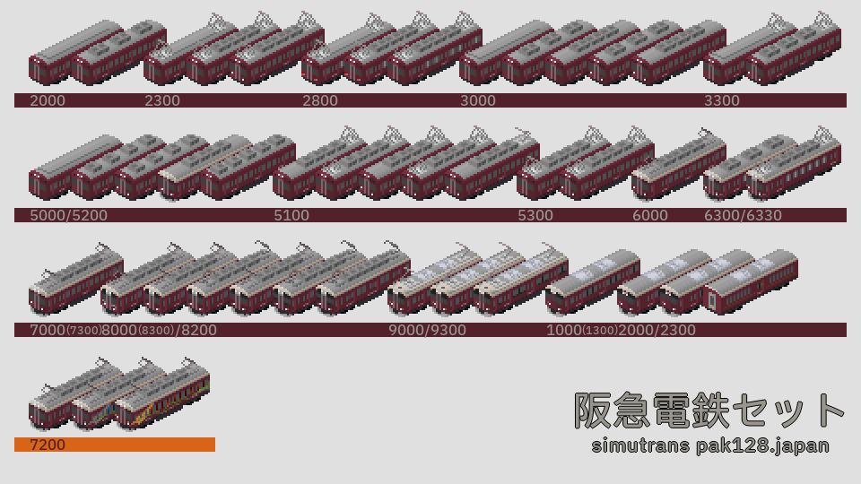

# 阪急電鉄セット

作者 - あるみどり (Twitter:[@G_alumi](https://twitter.com/G_alumi))

ライセンス - [CC BY-NC-SA](https://creativecommons.org/licenses/by-nc-sa/4.0/deed.ja)

各種アドオンの屋根上機器に[htrkdk様](https://sites.google.com/site/htrsimu)の京王7000系を使用させていただきました。
この場を借りてお礼申し上げます。

## 更新履歴
**v3.x以前からv4.x以降にバージョンアップする際はv4.0.0付属のcompat.tabを適用してください。**

### v4.0.0
- 6000系・7000系列を追加
- 9300系のグラフィックを修正
- 9000系列の後ろ向きMc車の車番を修正
- (ソースのディレクトリ構造を変更)
### v3.0.1
- 8000系列のパンタグラフ配置を修正
### v3.0.0
- 8000系列を追加

ぼちぼち追加していきます。

## 新2000/2300系
プレスの情報をもとに重量等不明な点は1000系をベースに作成しています。

基本的には
- Tc2000-M2500-M'2600-T2050-T2050-M2500-M'2600-Tc2100 (2000系)
- Tc2300-M2800-M'2900-T2350-T2350-M2800-M'2900-Tc2400 (2300系オール2等)
- Tc2300-M2800-M'2900-T2350-**T2450**-M2800-M'2900-Tc2400 (2300系 **座席指定車が一等**)

のように組んでいただければいいと思います。MM'が共通だったりサハが無限を足せるようにしているため、短い組成やふざけた組成も組めはします。

(座席指定車の車番がエラーですが、修正が難しいのでそのままにしています。)

なお、阪急車にはMcが必要だと思うのでMcとMc'が実装されています。かっこいいね。

## 新1000(1300)系
大差ないため1000系として実装しています。

### 組成例
- Tc1000-M1500-M'1600-T1050-T1050-M1500-M'1600-Tc1100

サハ脱車すれば7連が組める気がします。

阪急車にはMcが必要だと思うので2000系列同様McとMc'が実装されています。かっこいいね。

## 9000/9300系

### 組成例
- Mc9000-T9550-T9570-T9570-T9570-T9550-M9500-Mc9100 (9000系)
- Mc9300-T9850-T9870-T9870-T9870-T9850-M9800-Mc9400 (9300系)

T9570を脱車すると7連以下が組めたり3M1Tの4連も組める気がします。

## 8000(8300)系
大差ないため8000系として実装しています。

### 組成例
- Mc8000-M8600-T8550-T8550-T8550-T8550-M8500-Mc8100 (8R)
- Mc8000-M8600-T8550-T8550-T8550-     -M8500-Mc8100 (7R)
- Mc8000-     -T8550-T8550-T8550-     -M8500-Mc8100 (6R)
- Mc8000-Tc8150 (1・2次車のみ)

T8550は自由に追加できるので非力な超大編成も組めます

(8040/8200系)
- Mc8040-Tc8190
- Mc8200-Tc8250

Mc8040/Mc8200は0.75M0.25T・高ギア設定にしてあります。

## 7000(7300)系
大差ないため7000系として実装しています。

### 組成例
- Mc7000-M7500-T7550-T7550-T7550-T7550-M7600-Mc7100 (8R)
- Mc7000-M7500-T7550-T7550-T7550-     -M7600-Mc7100 (7R)
- Mc7000-     -T7550-T7550-T7550-     -M7600-Mc7100 (6R・3M3T)
- Mc7000-M7500-T7550-T7550-           -M7600-Mc7100 (6R・4M2T)
- Mc7000-Tc7150 (2R・1M1T)
- Mc7000-Mc7100 (2R・2M0T)

その他運転台撤去車Moを実装してあります。7000・8000系列の先頭車と連結できるハズです。

## 6000系
ほとんど7000系列と変わりませんが、乗務員室直後の小窓なし・MM'ユニット固定等で差別化しています。

### 組成例
- Mc6000-M6500-T6550-T6550-T6550-T6550-M6600-Mc6100 (8R)
- Mc6000-M6500-T6550-T6550-M6600-Mc6100 (6R)
- Mc6000-Mc6100 (2R)
